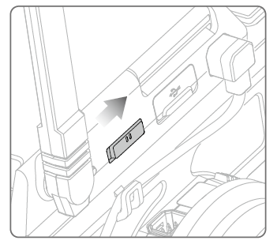
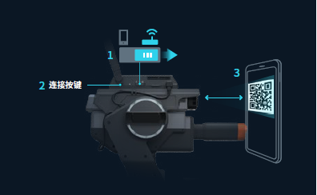

## RoboMaster EP SDK Tutorial

@author: Cao Zhanxiang

@email: caozx1110@163.com


### 1. Install

>   [官方教程](https://robomaster-dev.readthedocs.io/zh_CN/latest/python_sdk/installs.html)

​		在 Ubuntu 中只需

```sh
pip install robomaster
```


### 2. Connection

> [官方教程](https://robomaster-dev.readthedocs.io/zh_CN/latest/python_sdk/connection.html#)

​		推荐使用 **组网连接** 方式进行连接，将控制端设备（此处为PC Ubuntu）和 EP 连接至同一局域网内

​		EP 连接局域网的方式如下：

+ 开启机器人电源，切换智能中控的连接模式开关至 **组网模式**



+ 运行sdk代码 `/examples/01_robot/05_sta_conn_helper.py` 目录下的[例程](https://github.com/dji-sdk/RoboMaster-SDK/blob/master/examples/01_robot/05_sta_conn_helper.py)

```python
import time
import robomaster
from robomaster import conn
from MyQR import myqr
from PIL import Image


QRCODE_NAME = "qrcode.png"

if __name__ == '__main__':

    helper = conn.ConnectionHelper()
    # TODO: 修改 ssid （路由器名称）和 password (路由器密码)
    info = helper.build_qrcode_string(ssid="RoboMaster_SDK_WIFI", password="12341234")
    myqr.run(words=info)
    time.sleep(1)
    img = Image.open(QRCODE_NAME)
    img.show()
    if helper.wait_for_connection():
        print("Connected!")
    else:
        print("Connect failed!")
```

>   Note：代码中 ssid （路由器名称）和 password (路由器密码) 需要修改

+ 运行示例代码，会出现二维码图片，按下机器人智能中控上的扫码连接按键，会出现语音提示，使用自带摄像头对准二维码进行组网连接。



+   输出 `Connected!` 表示连接成功

>   Note: 如果 EP 已经连接过某 WIFI，再次启动时会自动连接上一次的 WIFI


### 3. Robot 对象

>   [官方例程](https://github.com/dji-sdk/RoboMaster-SDK/tree/master/examples/01_robot)

​		Robot 对象即为 EP 整体

+   初始化对象

```python
from robomaster import robot

ep_robot = robot.Robot()
```

+   建立连接（组网连接）

```python
# conn_type 可选，此处为组网连接
# SN 号可选，否则默认选择一个组网中的连接对象
ep_robot.initialize(conn_type="sta", sn="3JKDH2T001ULTD")
```

+   获取 SN 号（可选）

    SN 号理解为每一台 EP 独特的标识符

```python
SN = ep_robot.get_sn()
```

+   关闭连接

```python
ep_robot.close()
```


#### 3.1 Chassis 对象

>   [官方例程](https://github.com/dji-sdk/RoboMaster-SDK/tree/master/examples/02_chassis)

​		Robot 对象的成员，EP 的底盘

+   获取对象

```python
ep_robot = robot.Robot()
ep_robot.initialize(conn_type="sta")

ep_chassis = ep_robot.chassis
```

+   整体位置控制

​		x 前后（前为正方向，m）， y 左右（右为正方向，m），z 为旋转（左转为正，degree）

​		xy_speed，z_speed 分别为线速度（m/s)、角速度（degree/s）

```python
ep_chassis.move(x=0, y=0, z=0, xy_speed=0, z_speed=0).wait_for_completed()
```

>   Note: `.wait_for_completed()` 用法表示等待当前动作执行完毕

+   整体速度控制

​		x 前后（前为正方向，m/s）， y 左右（右为正方向，m/s），z 为旋转（右转为正，degree/s）

​		timeout 表示多少秒之内没有接到速度控制指令则停下

```
ep_chassis.drive_speed(x=0, y=0, z=0, timeout=5)
```

+   麦轮速度控制

    w1，w2，w3，w4 分别为右前，左前，左后，右后轮的转速（degree/s）

```python
ep_chassis.drive_wheels(w1=0, w2=0, w3=0, w4=0)
```

+   传感器

    freq 表示订阅频率，callback 指定回调函数

```python
# 订阅底盘位置信息
ep_chassis.sub_position(freq=1, callback=sub_info_handler)

# 订阅底盘姿态信息
ep_chassis.sub_attitude(freq=5, callback=sub_info_handler)

# 订阅底盘IMU信息
ep_chassis.sub_imu(freq=10, callback=sub_info_handler)

# 订阅底盘电调信息
ep_chassis.sub_esc(freq=20, callback=sub_info_handler)

# 订阅底盘状态信息：
ep_chassis.sub_status(freq=50, callback=sub_info_handler)
```

​		回调函数：

​		其中 `sub_info` 即为订阅返回的信息元组

```python
def sub_info_handler(sub_info):
    print("sub info: {0}".format(sub_info))
```

​		例如 IMU 回调函数解析可如下：

```python
def sub_imu_info_handler(imu_info):
    acc_x, acc_y, acc_z, gyro_x, gyro_y, gyro_z = imu_info
```


#### 3.2 Camera 对象

>   [官方例程](https://github.com/dji-sdk/RoboMaster-SDK/tree/master/examples/04_camera)

​		Robot 对象的成员，EP 的相机

+   获取对象

```python
ep_robot = robot.Robot()
ep_robot.initialize(conn_type="sta")

ep_camera = ep_robot.camera
```

+   获取视频流

```python
# 开启视频流
ep_camera.start_video_stream(display=False)
while True:
    # strategy: "pipeline" / "newest"
    # 读取帧策略：pipeline 依次读取缓存的帧信息，newest 获取最新的一帧数据，会清空旧的数据帧
    img = ep_camera.read_cv2_image(strategy="pipeline")
    
    cv2.imshow("camera", img)
    cv2.waitKey(1)
cv2.destroyAllWindows()
# 停止视频流
ep_camera.stop_video_stream()
```


#### 3.3 Robotic Arm 对象

>   [官方例程](https://github.com/dji-sdk/RoboMaster-SDK/tree/master/examples/10_robotic_arm)

​		Robot 对象的成员，EP 的机械臂

+   获取对象

```python
ep_robot = robot.Robot()
ep_robot.initialize(conn_type="sta")

ep_arm = ep_robot.robotic_arm
```

+   绝对位置控制

    末端移动至坐标 (x, y) 处，单位 mm

```python
ep_arm.moveto(x=100, y=100).wait_for_completed()
```

+   相对位置控制

    末端相对现在偏移 (x, y)，单位 mm

```python
ep_arm.move(x=20, y=20).wait_for_completed()
```


#### 3.4 Gripper对象

>   [官方例程](https://github.com/dji-sdk/RoboMaster-SDK/tree/master/examples/11_gripper)

​		Robot 对象的成员，EP 的夹爪

+   获取对象

```python
ep_robot = robot.Robot()
ep_robot.initialize(conn_type="sta")

ep_arm = ep_robot.gripper
```

+   张开机械爪

    power 表示夹爪的力度

```python
ep_gripper.open(power=50)
time.sleep(1)
ep_gripper.pause()
```

+   闭合机械爪

    power 表示夹爪的力度

```python
ep_gripper.close(power=50)
time.sleep(1)
ep_gripper.pause()
```


### 4. 参考链接🔗

>   +   [官方教程](https://robomaster-dev.rtfd.io/)
>   +   可参考 [官方例程](https://github.com/dji-sdk/RoboMaster-SDK/tree/master/examples) 编写程序
>   +   可在 [源码](https://github.com/dji-sdk/RoboMaster-SDK/tree/master/src/robomaster) 中查询所有可用的接口
